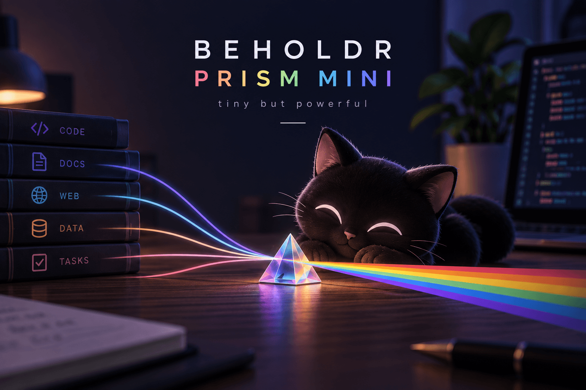

# Beholdr Prism Mini

[](LICENSE)
[](SKILL.md)
[](SKILL.md)



**Simple, configurable subagent routing.**

An Agent Skill that routes subagent work by role and mode. Fast, cheap workers read large codebases, research the web, or apply mechanical edits, and hand short sourced briefs to the primary model, which keeps the design, decisions, and review.

## Try It

```bash
npx skills add beholdrlabs/beholdr-prism-mini
```

Then tell your assistant:

> Set up prism-mini routing.

Once the config has models, ask for a wide sweep:

> Use prism-mini to trace how a request flows through this repo.

## What Changes

- **Reading moves out of the primary:** workers sweep files or the web and return short briefs with file and line or URL sources.
- **Three modes:** a reader for codebases, a researcher for the web, and an editor for mechanical changes the primary has already decided.
- **Models come from a config:** new models need a config edit, not a skill release.
- **Small tasks stay with the primary:** delegation loses money on a few known files, audits, reviews, and design decisions, so the skill declines them and says why.

Tested in Claude Code and Codex. Recipes for omp (including OpenRouter models) and Herdr panes are documented but untested. The larger `beholdr-prism` project will be the experimental model router and plugin.

## Does It Pay Off?

Each task ran twice from a fresh checkout with the same prompt: once as a **control** (the primary model alone, reading everything itself) and once with **prism-mini** (the same primary delegating reading to cheaper workers). Answers were graded against fact lists written from the code before the runs.

| Task | Repo size | Harness and models | Control | With prism-mini | Cost | Facts found (control / prism) |
| --- | ---: | --- | ---: | ---: | :---: | :---: |
| Four files | 29k lines | Claude Code: Opus, Haiku workers | $0.81 | $0.91 | +12% | 14.5 / 14.5 of 15 |
| Whole repo | 29k lines | Claude Code: Opus, Haiku workers | $0.97 | $0.76 | −22% | 16 / 15.5 of 16 |
| Cross-package trace | 453k lines | Claude Code: Opus, Haiku workers | $1.80 | $0.93 | **−48%** | 15 / 15 |
| Cross-package trace | 453k lines | Codex: Sol, Luna workers | $0.60 | $0.36 | **−40%** | 15 / 15 |

Pilot results: one run per cell; two runs of an unchanged setup differed by about 15%.

- **Small tasks cost more; large codebases save 40-50%.** The skill now declines small tasks instead of paying the handoff.
- **Same facts, less depth.** On the large repo, the control run also found two real bugs; the delegated answers were shorter.
- **Count dollars, not tokens.** With prompt caching, cost follows new tokens in the primary's context and the number of primary turns. Delegation wins when it moves a long reading loop out of the primary.
- **What didn't help:** an unlimited worker budget (+27% cost, no better answers) and a hook that compresses tool output (no saving; the primary read more).

Details, cost breakdowns, and limitations: [docs/evaluation.md](docs/evaluation.md). The story behind it: [Cheap Readers, Expensive Briefs](https://cbakis.com/blog/cheap-readers-expensive-briefs).

## Setup

Requires Node.js 22.18+ or Bun. The script has no dependencies. Install the skill with the [skills CLI](https://github.com/vercel-labs/skills) as shown in [Try It](#try-it) (`bunx` works instead of `npx`).

Then ask your agent to set up prism-mini routing, or run the script yourself from your project (`<skill-dir>` is where the skill was installed, such as `~/.agents/skills/beholdr-prism-mini`; `bun` works instead of `node`):

    node <skill-dir>/scripts/prism.ts init --project   # or --user
    node <skill-dir>/scripts/prism.ts check             # after filling in candidates
    node <skill-dir>/scripts/prism.ts agents --write    # or --user; prints them without --write

`agents` writes `prism-reader`, `prism-researcher`, and `prism-editor` for Claude Code (`.claude/agents/*.md`, with tool lists, `maxTurns`, and a read-only Bash guard) and `prism_reader`, `prism_researcher`, and `prism_editor` for Codex (`.codex/agents/*.toml`, with read-only or workspace-write sandboxes). The Claude Code guard is referenced by absolute path, so prefer `--user` over committing project agent files.

## Config

Project: `.beholdr/prism-mini.config.json` (found from any subdirectory up to the git root). User: `~/.beholdr/prism-mini.config.json`. A project role list replaces the user's list for that role; anything the project leaves out is inherited.

    {
      "$schema": "file:///path/to/beholdr-prism-mini/assets/config.schema.v1.json",
      "version": 1,
      "roles": {
        "fast": [{ "model": "<model id>", "via": "omp", "effort": "low" }],
        "reasoning": [{ "model": "<model id>", "via": "claude-code", "effort": "high" }]
      },
      "compression": {
        "enabled": true,
        "brief_max_words": 800,
        "total_brief_max_words": 2000,
        "worker_max_tool_calls": 15,
        "research": { "brief_max_words": 2000, "total_brief_max_words": 5000, "worker_max_tool_calls": 30 }
      }
    }

`via` is `claude-code`, `codex`, `omp`, or `herdr:<kind>`. The `compression` values above are the defaults; `research` applies to the researcher mode.

Candidates are tried in order. The schema is `assets/config.schema.v1.json`; `init` sets `$schema` so JSON-aware editors validate the file and show field descriptions on hover. Duplicate keys are rejected. Never put API keys in the config.

## Upgrading

The config carries a `version`. When a skill release changes the format, `check` exits 4 and `prism.ts migrate --write` upgrades the file, keeping a `.bak` copy.

## More

- [Dispatch recipes](references/dispatch.md) per harness.
- [Choosing models](references/choosing-models.md): selection criteria, dated examples, and benchmark evidence.
- [Evaluation results](docs/evaluation.md) and [harness](evals/README.md): tasks, answer keys, and scripts for the Claude Code and Codex comparisons.
- [Earlier discussion](docs/skill-discussion.md) on why the mini skill and the experimental router are separate.

## Feedback

Try it on one real task in a large codebase. [Open an issue](https://github.com/beholdrlabs/beholdr-prism-mini/issues) with **the harness and models you used, what it cost, and whether the briefs missed anything**. Keep private code and API keys out of public posts.

## Development

The skill runs `scripts/prism.ts` directly with Node's type stripping or Bun; `package.json` only adds dev tools. Run `bun install` (or `npm install`) once for editor types, then `npm test` or `bun test tests/` and `npm run typecheck`. `scripts/readonly-guard.ts` is the read-only Bash hook for Claude Code workers. `scripts/validate.ts` implements the JSON Schema keywords the config schema uses; a test fails if the schema starts using one it does not support.

## License

[MIT](LICENSE)
